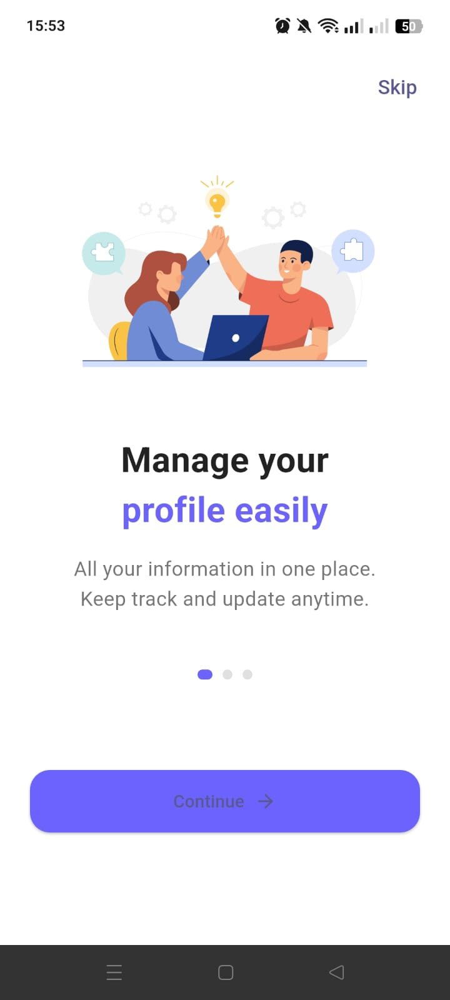
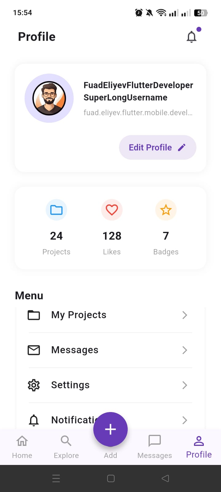
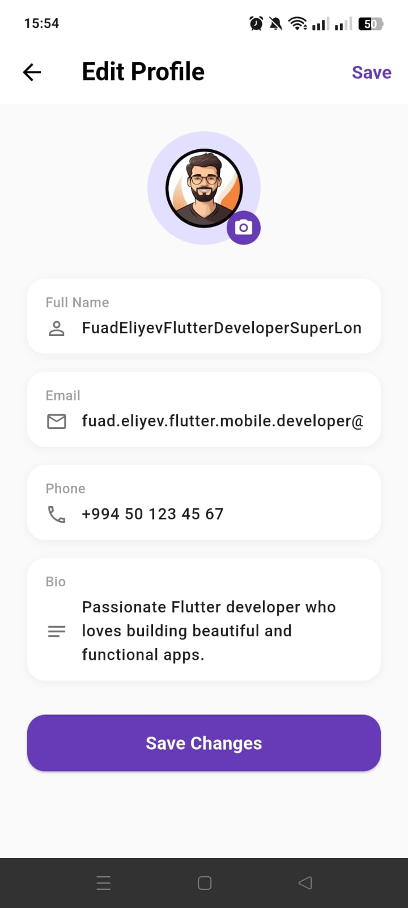
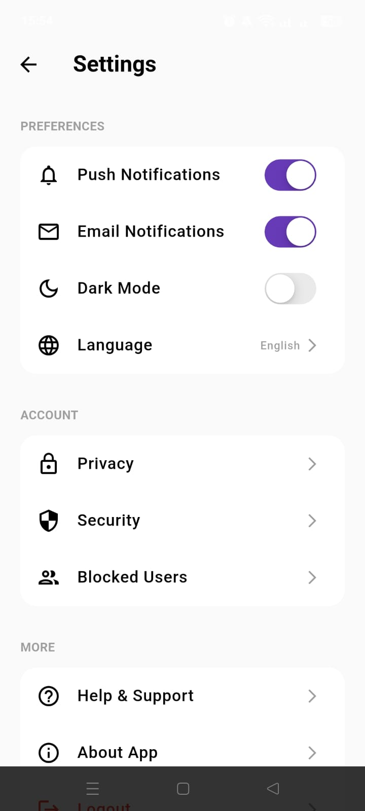

# 📱 First Task - Onboarding & Analytics App

> **DevJoint Internship Program** çərçivəsində hazırlanmış, istifadəçilərin linklərini saxlamasına, təşkil etməsinə və statistikalarını izləməsinə imkan verən mobil Flutter tətbiqi.

---

## 📌 Layihə Haqqında (About The Task)

Bu layihə **DevJoint** təcrübə proqramının ilk tapşırığı (**First Task**) olaraq hazırlanmışdır. Əsas məqsəd verilmiş UI/UX dizaynını piksel dəqiqliyi ilə koda köçürmək, müasir UI komponentlərindən (Glow/Blur effektləri) istifadə etmək və adaptiv interfeys qurmaqdır.

---

## 🌟 Özəlliklər (Features)

- 🎨 **Müasir UI/UX Dizayn:** Dark Mode konsepsiyası və xüsusi neon glowing (BackdropFilter) effektləri.
- 📊 **İzlə və Paylaş:** Ziyarət sayı, keçidlər və kolleksiyaların vizual diaqramlarla təqdim olunması.
- 📐 **Pixel-Perfect & Responsive:** Müxtəlif ekran ölçülərinə (xüsusilə 360x800) tam uyğunlaşdırılmış düzəliş (layout).
- ⚡ **Yüngül və Donmayan Arxitektura:** Cihaz resurslarını yormayan, optimallaşdırılmış widget strukturu.

---

## 📸 Ekran Görüntüləri (Screenshots)

| Onboarding | Profile | Edit Profile | Settings |
| :---: | :---: | :---: | :---: |
|  |  |  |  |

---

## 🛠️ Texnologiyalar (Tech Stack)

- **Framework:** [Flutter](https://flutter.dev/) (3.x)
- **Language:** [Dart](https://dart.dev/)
- **UI Architecture:** Custom Blur Glows, Stack & Column Layouts, Responsive Sizing

---

## 🚀 Quraşdırma və İşə Salma (Getting Started)

Proqramı öz kompyuterinizdə və ya cihazınızda işə salmaq üçün aşağıdakı addımları izləyin:

### Önşərtlər (Prerequisites)
- [Flutter SDK](https://docs.flutter.dev/get-started/install)
- [VS Code](https://code.visualstudio.com/) və ya [Android Studio](https://developer.android.com/studio)

### Quraşdırma Addımları

1. Repozitoriyanı klonlayın:
git clone [https://github.com/AskarovaAydan/first_task.git](https://github.com/AskarovaAydan/first_task.git)

2. Proqram qovluğuna keçin:
cd first_task

3. Asılılıqları (packages) yükləyin:
flutter pub get

4.Tətbiqi işə salın:
flutter run

Müəllif və Təşəkkür (Author & Credits)

Developer: Aydan Əskərova

Program: DevJoint Internship
